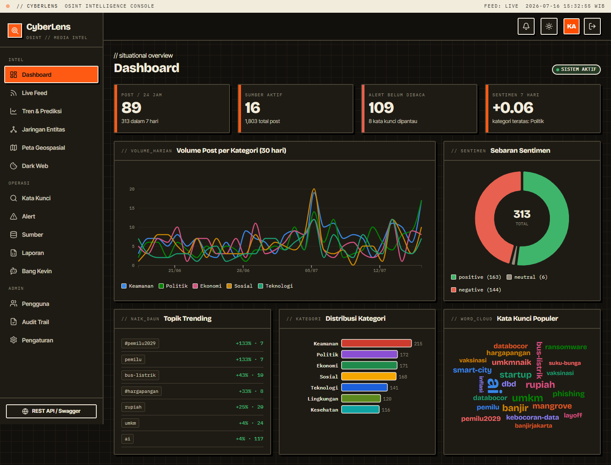

# CyberLens

> OSINT (Open Source Intelligence) & media-monitoring platform — collect, process, analyze, and visualize open-source information in real time, with an AI intelligence assistant.

**Bahasa Indonesia?** See [README.id.md](README.id.md).

Built with **Blazor Server (.NET 10)**, **D3.js**, and **Semantic Kernel**, in a modern **neo-brutalist** design with light/dark themes.



---

## Features

- **Data collection** — **real, live** crawlers with a pluggable connector framework: RSS/Atom (Antara, Google News ID, BBC World), **Reddit** and **Mastodon** (real, no keys needed), plus **YouTube, Twitter/X, Facebook, Threads, TikTok** via their official APIs (enable + add credentials in Settings), and an optional **simulated** stream for demo. Runs **on a schedule** (background) or **on demand** ("Crawl sekarang"). Every item is normalized, de-duplicated by content hash, sentiment-scored, auto-categorized, tagged, and geocoded.
- **Crawler Ops dashboard** — collection statistics and activity logs in charts + a filterable table: runs, items collected, success rate, average duration; items-per-day, success/fail, items-per-connector, and top-locations charts; filters by period, connector/source, status, and trigger. A **live running indicator** (classification strip + status banner) shows whether the crawler is running, idle, or off.
- **Processing** — multi-language (ID/EN) lexicon sentiment analysis with negation handling, keyword-based topic classification (Politik, Ekonomi, Keamanan, Teknologi, Sosial, Kesehatan, Lingkungan).
- **Analysis & intelligence** — dashboard stats, trend analysis, real-time keyword monitoring, entity network analysis, geospatial analysis, and **AI-based prediction** (linear-regression volume forecast).
- **AI Analytics** — an **LLM-generated intelligence brief** from the crawled data: executive summary, risk assessment, key findings, recommendations, top threats, and a 7-day outlook, alongside supporting charts. Runs on your configured provider (OpenAI / Anthropic / Gemini / Ollama).
- **Visualization** — interactive D3.js dashboard: trend lines with forecast, sentiment donut, category bars, word cloud, force-directed entity graph, and a **Leaflet** geospatial map with real tiles.
- **3D intelligence globe** — a **Three.js / WebGL** interactive Earth that maps OSINT spatially: sentiment heatmap (red = negative, green = positive, yellow = neutral), source geolocation markers, event-clustering bubbles (size = intensity), a timeline overlay (play the evolution over time), and a threat-intelligence layer — all toggleable, with drag-to-rotate and scroll-to-zoom.
- **Alerting & reporting** — real-time keyword alerts (in-app toasts + notification bell), scheduled auto-reports (daily/weekly/monthly), and PDF (QuestPDF) / Excel (ClosedXML) export.
- **Collaboration & security** — multi-user with role-based access (Viewer / Analyst / Admin), PBKDF2 password hashing, audit trail, cookie authentication.
- **"Bang Kevin" AI assistant** — multi-session chat (create / delete / reset) with **clickable example prompts**, image & document attachments, Markdown rendering (tables, media, code). Built on Semantic Kernel with **switchable providers: OpenAI, Anthropic, Gemini, Ollama**, and kernel functions for Tavily web search, page scraping, reading files from URLs, date/time, math, and querying the platform's own OSINT data.
- **Dark web monitoring** and a **REST API** (Minimal API + Swagger) for external integration.

## Tech stack

| Layer | Technology |
|-------|-----------|
| UI | Blazor Server (.NET 10, Interactive Server), D3.js v7 + d3-cloud, Three.js r160 (3D globe) |
| Design | Neo-brutalism, Bricolage Grotesque + IBM Plex Mono + Inter Tight, light/dark |
| Data | EF Core 10 — **SQLite / SQL Server / MySQL / PostgreSQL** |
| Storage | **FileSystem / Azure Blob / Amazon S3 / MinIO** |
| AI | Microsoft Semantic Kernel — OpenAI / Anthropic / Gemini / Ollama |
| Reporting | QuestPDF (PDF), ClosedXML (Excel) |
| API | ASP.NET Minimal API + Swashbuckle (Swagger) |

## Quick start

Requires the **.NET 10 SDK**.

```bash
cd src/CyberLens
dotnet run
```

Open the printed URL (e.g. `http://localhost:5009`). On first run the database is created and seeded automatically (SQLite by default — no setup needed).

### Demo accounts

Password equals the username.

| Username | Role | |
|----------|------|--|
| `admin` | Admin | full access |
| `supervisor` | Admin | full access |
| `analyst`, `analyst2` | Analyst | intel + operations |
| `viewer`, `viewer2` | Viewer | read-only |

## Configuration

**All operational configuration** (database provider & connection strings, storage backend, AI provider & API keys, Tavily key, crawler, alerting, REST API key, reporting) lives in **`config/cyberlens.settings.json`** and is **fully editable in-app** from the **Settings** page (Admin only). `appsettings.json` holds only logging. Database and storage provider changes take effect after a restart; AI, crawler, keyword, and API changes apply immediately.

See [docs/configuration.md](docs/configuration.md) for every setting.

## REST API

Enabled by default at `/api/v1`, documented at `/swagger`. Send the API key in the `X-Api-Key` header (default `cyberlens-demo-key`, changeable in Settings).

```bash
curl -H "X-Api-Key: cyberlens-demo-key" http://localhost:5009/api/v1/stats
```

See [docs/api.md](docs/api.md) for all endpoints.

## Documentation

Full docs are in [`docs/`](docs/):

- [Architecture](docs/architecture.md)
- [Installation](docs/installation.md)
- [Configuration](docs/configuration.md)
- [Database providers](docs/database.md)
- [Storage backends](docs/storage.md)
- [Data collection & Crawler Ops](docs/crawler.md)
- [AI Analytics](docs/ai-analytics.md)
- [3D intelligence globe](docs/globe.md)
- [REST API](docs/api.md)
- [Bang Kevin (AI assistant)](docs/chatbot.md)
- [User guide](docs/user-guide.md)
- [Security](docs/security.md)

## Project layout

```
src/CyberLens/
├── Api/               REST API endpoints + X-Api-Key filter
├── Components/
│   ├── Layout/        Shell, sidebar, classification strip, notifications
│   └── Pages/         Dashboard, Feed, Trends, Network, GeoMap, DarkWeb,
│                      Keywords, Alerts, Sources, Reports, Chat, Users,
│                      Audit, Settings, Login
├── Data/              EF Core entities, DbContext, seeder, sample content
├── Models/            Editable AppConfig
├── Services/
│   ├── Analysis/      Sentiment, topic classifier, analytics + forecast
│   ├── Chat/          Semantic Kernel, providers, plugins, Markdown
│   ├── Collection/    Crawler + alert monitor (background services)
│   ├── Reporting/     PDF/Excel report generation + scheduler
│   └── Storage/       IFileStorage + 4 backends + factory
└── wwwroot/           app.css (design system), js/charts.js (D3), js/app.js
```

## Notes

- The simulated social-media stream and all sample data are **fictional**, for demonstration. Disable it in Settings and add real RSS feeds (or wire real social APIs) for production use.
- Set a real AI provider API key in Settings to activate Bang Kevin.

## Credits

Dibuat oleh **Gravicode Studios**, dipimpin oleh **Kang Fadhil**.

## License

Provided as-is for demonstration and internal use.
