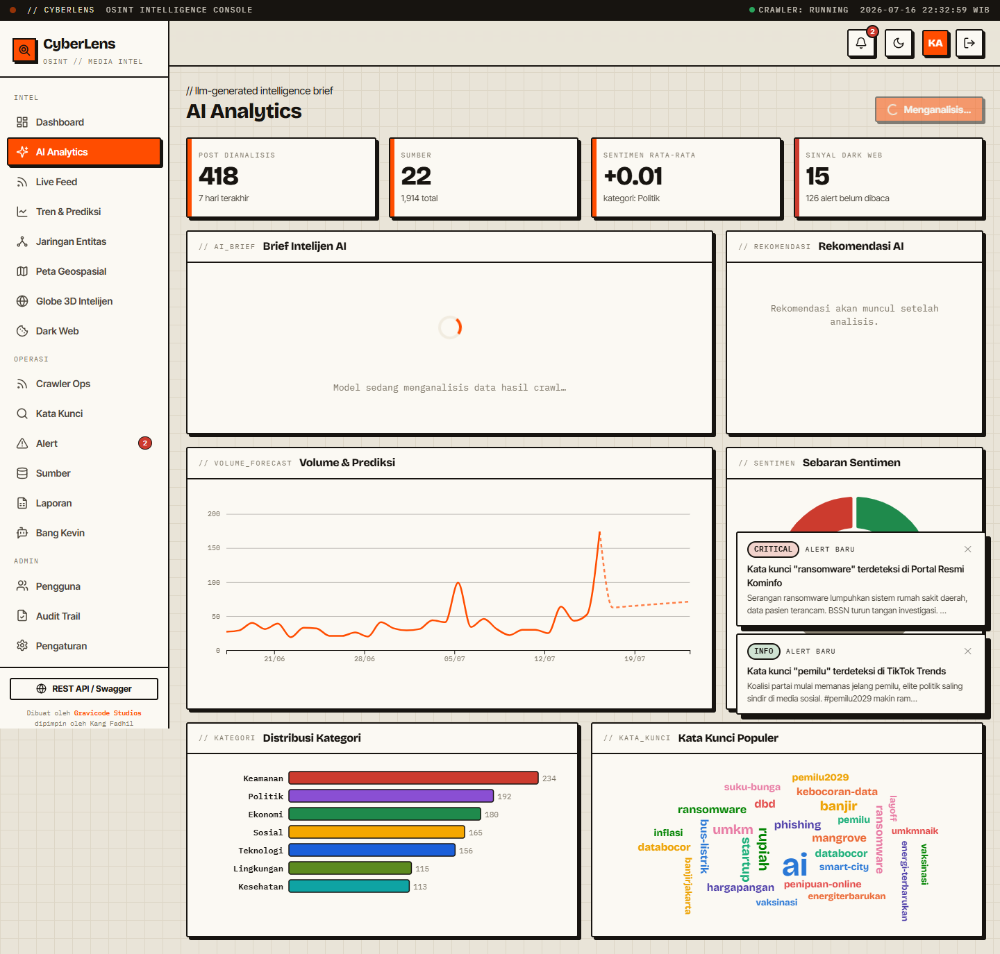

# AI Analytics

The **AI Analytics** page (`/ai-analytics`) turns the crawled data into an **LLM-generated intelligence brief**, alongside supporting charts. It runs on the same provider you configure for Bang Kevin (OpenAI / Anthropic / Gemini / Ollama).

## What it does

1. **Digests the data** — `AiAnalyticsService` compiles a compact digest of the platform's own analytics for the last 7–30 days: volume, sentiment breakdown, trending topics, category distribution, top keywords, top locations, top sources, and dark-web signal count.
2. **Asks the LLM** — it sends that digest to the configured model and requests a structured JSON brief.
3. **Renders the brief**:
   - **Executive summary** (2–3 sentences)
   - **Risk assessment** — a level (Low / Medium / High / Critical) shown as a colored gauge, with rationale
   - **Key findings** (5–7)
   - **Recommendations** (4–6, actionable)
   - **Top threats** (2–4, with reasons)
   - **7-day outlook**
4. **Supporting visuals** — volume + forecast line, sentiment donut, category bars, and a keyword word cloud, rendered from the data (these show even without an AI key).

The brief auto-generates when you open the page and can be regenerated with the button. If no AI provider key is configured, the brief area shows a clear message pointing to Settings, while the charts still render.

## Notes

- The model is asked to return JSON; if it returns prose instead, the text is shown as the summary (the page degrades gracefully).
- Temperature is low (0.4) for consistent, grounded analysis; the digest keeps the prompt small and cheap.
- Set the provider/key in **Settings → Bang Kevin**. See [chatbot.md](chatbot.md).

---

Dibuat oleh **Gravicode Studios**, dipimpin oleh **Kang Fadhil**.
