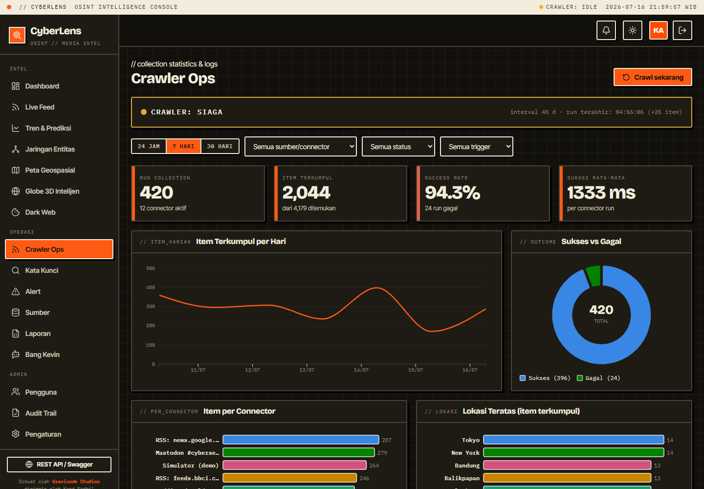

# Data collection & Crawler Ops

CyberLens collects from real sources on a schedule and on demand, logs every connector run, and shows live status. Manage it from the **Crawler Ops** page (`/crawler`) and **Settings**.

## Connectors

One collection pass runs every enabled connector; each is logged as a `CrawlRun`.

| Connector | Type | Credentials | Notes |
|-----------|------|-------------|-------|
| **RSS/Atom feeds** | News | none | Real. Ships with Antara, Google News ID, BBC World; add your own in Settings. |
| **Reddit** | Forum | none | Real. Public JSON API (`/r/{sub}/new.json`); configure subreddits. On by default. |
| **Mastodon** | Social | none | Real. Public hashtag timelines; configure instance + hashtags. On by default. |
| **YouTube** | Social | API key | Real. YouTube Data API v3 `search.list`. Set the API key + search terms. |
| **Twitter / X** | Social | Bearer token | Real. X API v2 recent search. Set the App Bearer token + search terms. |
| **Facebook** | Social | Access token | Real. Graph API page feed. Set a Page token + Page IDs. |
| **Threads** | Social | Access token | Real. Threads Graph API. Set the access token + user id. |
| **TikTok** | Social | Client key/secret | Real. Official TikTok API (client-credentials + video query); needs an approved developer app. |
| **Dark Web** | Dark Web | Tor proxy / API key | Real. Fetches configured `.onion` pages through a Tor SOCKS5 proxy, and/or a threat-intel JSON feed. See below. |
| **Simulator** | Social | none | Optional demo traffic when live social APIs aren't configured. |

### Dark web monitoring

The `DarkWebConnector` does real dark-web collection two ways (configure in **Settings → Dark Web**):

- **`.onion` via Tor** — set `TorProxy` (default `socks5://127.0.0.1:9050`, requires a running Tor client) and list `OnionUrls`. Pages are fetched through the SOCKS5 proxy (.NET `SocketsHttpHandler` + `WebProxy`), scraped to text, and stored as dark-web items (threat-flagged).
- **Threat-intel feed** — set `ThreatIntelApiUrl` (+ optional `ThreatIntelApiKey`) to pull a clearnet JSON feed of leaks/pastes; the connector maps common field names (title/content/url/date) generically.

Disabled by default. Without Tor running, the `.onion` fetch simply fails and is logged — no crash. (The **Dark Web** page's demo entries come from the simulator; real findings appear once this connector is configured.)

**Reddit and Mastodon work out of the box** (no keys). YouTube/Twitter/Facebook/Threads/TikTok are fully implemented against their official APIs but stay idle until you provide credentials — configure them in **Settings → Media Sosial — API**. On a manual run, unconfigured-but-enabled connectors are logged as "Kredensial belum diatur" so you can see what still needs keys.

Every item — from any connector — is normalized, de-duplicated by content hash, sentiment-scored, auto-classified, tagged, and geocoded (a lightweight geocoder assigns coordinates when a known city is mentioned, so real items still appear on the maps and 3D globe).

## Scheduled vs manual

- **Scheduled**: the background `CrawlerService` runs a pass every `Crawler.IntervalSeconds` (default 45s) while `Crawler.Enabled` is true.
- **Manual**: the **Crawl sekarang** button (Crawler Ops and Sources pages, Analyst/Admin) runs a pass immediately.

Both share one code path (`CollectorService`), so behavior is identical.

## Running indicator

Two live indicators show whether collection is happening:

- The **classification strip** (top bar) shows `CRAWLER: RUNNING / IDLE / OFF` with a colored dot (green = running, amber = idle, red = disabled). Click it to open Crawler Ops.
- The **status banner** on Crawler Ops shows the current state, the connector being processed, the interval, the last run time and item count, and the estimated next run.

Both update in real time via `CrawlerStatusService` (no refresh needed).

## The dashboard

- **Stat cards**: runs, items collected (added / found), success rate, average duration.
- **Charts**: items collected per day, success vs failed donut, items per connector, top locations of collected items.
- **Filters**: period (24h / 7d / 30d), connector/source, status (success/failed), trigger (scheduled/manual).
- **Activity log table**: time, connector, kind, trigger, found/new/duplicate counts, duration, and status (hover a failed row for the error).

## Configuration

All connector settings and credentials live in `config/cyberlens.settings.json` under `Social`, editable in **Settings** (Admin). See [configuration.md](configuration.md). Changes apply on the next pass — no restart needed.

---

Dibuat oleh **Gravicode Studios**, dipimpin oleh **Kang Fadhil**.
