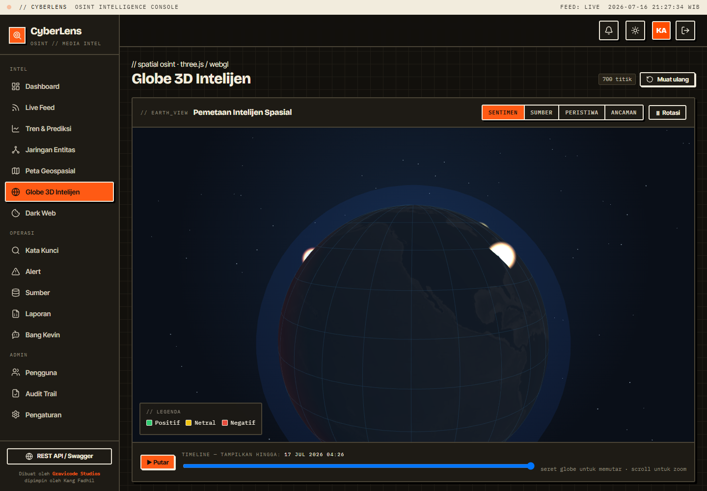

# 3D Intelligence Globe

The **Globe 3D Intelijen** page (`/globe`) maps OSINT data onto an interactive 3D Earth using **Three.js / WebGL**, driven by Blazor Server. It renders the same geo-located posts used elsewhere, projected onto the globe as toggleable layers with a time dimension.

## Layers

Toggle each layer independently from the header:

| Layer | What it shows | Encoding |
|-------|---------------|----------|
| **Sentimen** (default) | Sentiment heatmap of geo-located posts | Additive glow points — **green** positive, **yellow** neutral, **red** negative; size = engagement intensity |
| **Sumber** | Source geolocation markers | Cones on the surface, colored by source kind (news / social / blog / forum / official / dark web) |
| **Peristiwa** | Event clustering | Translucent bubbles at location centroids; **bubble size = number of events**; color = average sentiment |
| **Ancaman** | Threat intelligence | Pulsing red bars rising from locations with dark-web sources or security-category posts |

## Timeline overlay

The slider at the bottom filters points to those published **up to** the selected moment, so you can watch how sentiment and activity evolved. Press **▶ Putar** to animate the evolution automatically. Event-cluster bubbles are always visible (they are aggregates).

## Interaction

- **Drag** to rotate the globe.
- **Scroll** to zoom.
- **Hover** a point/marker/bubble/bar for a tooltip (location, source, sentiment, category).
- **⏸ / ▶ Rotasi** toggles auto-rotation.

## How it works

- Data comes from `AnalyticsService.GetGlobePointsAsync` (per-post: lat/lon, sentiment, source kind, category, timestamp, intensity, threat flag) and `GetGlobeClustersAsync` (per-location aggregates). Capped to the most recent ~700 geo-located points for performance.
- Rendering is `wwwroot/js/globe.js`, a Three.js **ES module** imported by full CDN URL (`three@0.160`), so it needs no import map and does not conflict with Blazor's own `<ImportMap>`. Camera drag/zoom is implemented directly (no `OrbitControls`, which would require a bare-specifier import map).
- The Earth uses an equirectangular texture (`three-globe` example image) with a graceful fallback to a plain shaded sphere if the texture can't load. A graticule, atmosphere glow, and starfield complete the scene.
- Blazor passes data via JS interop (`clGlobeInit`), and drives layers/timeline/rotation via `clGlobeToggleLayer`, `clGlobeSetMaxTime`, and `clGlobeAutoRotate`.

## Notes

- Only posts with coordinates appear. The simulated stream assigns realistic coordinates to ~70% of items; real RSS items get coordinates only if the feed provides them, so enable the sentiment layer with demo data to see a populated globe.
- WebGL is required (any modern browser). The globe is dark by design regardless of the app light/dark theme.
