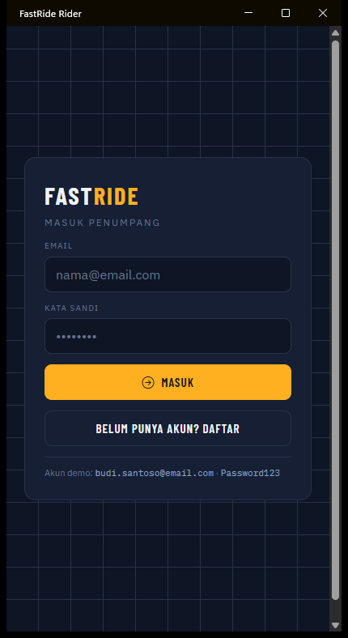
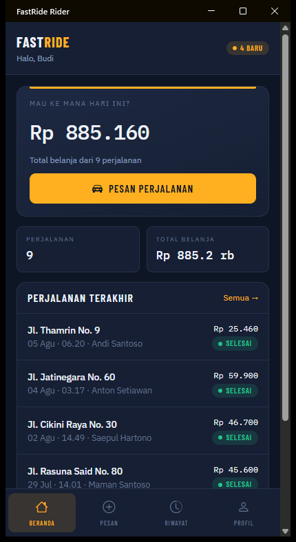
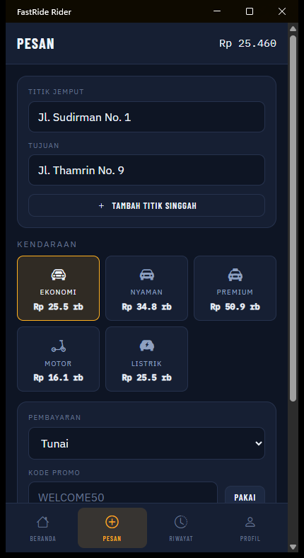
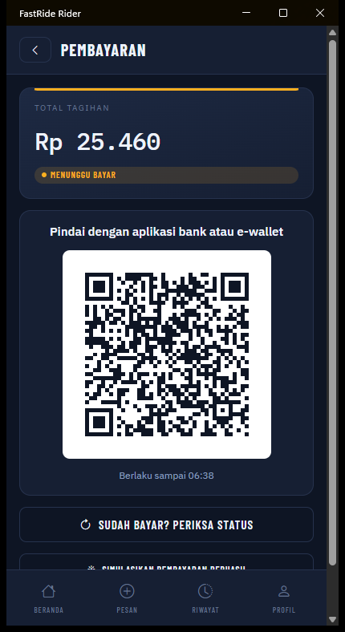
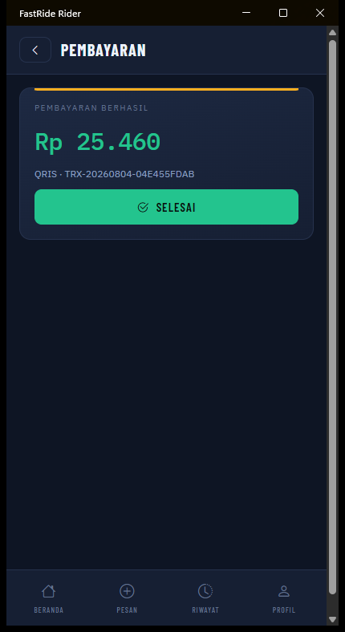

# 🚖 FastRide — Platform Ride-Hailing

> Platform ride-hailing lengkap di atas .NET 10: API, konsol operasi, aplikasi penumpang,
> aplikasi driver, dan simulator lalu lintas order.

[](https://dotnet.microsoft.com)
[]()
[](LICENSE)

---

## Tampilan

### Konsol operasi

Rel **Fleet Pulse** di atas layar menjawab satu pertanyaan yang paling sering ditanyakan
supervisor — berapa banyak armada yang benar-benar bekerja sekarang — dengan satu pip per
driver, diwarnai menurut semantik lampu lalu lintas.


<table>
<tr>
<td width="50%"><br /><sub><b>Order</b> — cari, saring, dan tindak lanjuti perjalanan</sub></td>
<td width="50%"><br /><sub><b>Pembayaran</b> — ganti gateway tanpa deploy ulang</sub></td>
</tr>
</table>

### Aplikasi penumpang

Alur QRIS dari memilih metode sampai lunas — QR-nya payload EMVCo sungguhan, bukan gambar
tempelan.

<table>
<tr>
<td width="20%"><br /><sub>Masuk</sub></td>
<td width="20%"><br /><sub>Beranda</sub></td>
<td width="20%"><br /><sub>Pesan — harga dari tabel tarif</sub></td>
<td width="20%"><br /><sub>Bayar — QRIS</sub></td>
<td width="20%"><br /><sub>Lunas</sub></td>
</tr>
</table>

Selengkapnya: [konsol operasi](docs/DASHBOARD.md) · [alur pembayaran](docs/PAYMENTS.md)

---

## Isi

| Proyek | Apa itu |
|--------|---------|
| `FastRide.Api` | Minimal API — seluruh aturan bisnis dan satu-satunya yang menyentuh database |
| `FastRide.AdminWeb` | Konsol operasi (Blazor Server) |
| `FastRide.RiderApp` | Aplikasi penumpang (MAUI Blazor Hybrid) |
| `FastRide.DriverApp` | Aplikasi driver (MAUI Blazor Hybrid) |
| `FastRide.Simulator` | Simulator penumpang & driver (Spectre.Console) |
| `FastRide.Shared` | Model, DTO, dan helper yang dipakai bersama |
| `FastRide.Data` | EF Core DbContext + data contoh |

---

## Mulai cepat

```bash
dotnet restore

# 1. API  →  https://localhost:5001
dotnet run --project FastRide.Api

# 2. Konsol operasi  →  https://localhost:5002
dotnet run --project FastRide.AdminWeb

# 3. Simulator (opsional, untuk mengisi dashboard dengan lalu lintas hidup)
dotnet run --project FastRide.Simulator -- --duration 60
```

Data contoh dibuat otomatis saat API pertama kali dijalankan.

### Akun demo

| Peran | Email | Kata sandi |
|-------|-------|------------|
| Admin | `admin@fastride.com` | `Password123` |
| Penumpang | `budi.santoso@email.com` | `Password123` |
| Driver | `andi.santoso@drive.com` | `Password123` |

### Aplikasi mobile

Butuh workload MAUI (`dotnet workload install maui`):

```bash
dotnet run --project FastRide.RiderApp -f net10.0-windows10.0.19041.0
dotnet run --project FastRide.DriverApp -f net10.0-windows10.0.19041.0
```

---

## Fitur

| Area | Isi |
|------|-----|
| **Pemesanan** | Estimasi tarif sebelum pesan, 5 kategori kendaraan, multi-stop, promo |
| **Pembayaran** | Tunai, **QRIS**, e-wallet, kartu, virtual account — lewat Midtrans, Xendit, atau sandbox. Gateway diganti dari konsol admin |
| **Siklus perjalanan** | `Menunggu → Diterima → Driver tiba → Berjalan → Selesai`, dengan validasi transisi |
| **Pelacakan** | Posisi driver, jarak, dan ETA untuk perjalanan berjalan |
| **Driver** | Status online, penawaran order terdekat, pendapatan harian, verifikasi dokumen |
| **Tarif** | Tarif dasar + jarak + waktu, pengali *surge*, tarif minimum, biaya pembatalan |
| **Promo** | Persentase atau potongan tetap, batas maksimum, minimum transaksi, kuota, khusus kategori |
| **Ulasan** | Dua arah, satu ulasan per orang per perjalanan |
| **Konsol admin** | Ringkasan langsung, order, driver, penumpang, pembayaran, laporan, tarif, promo, verifikasi, pengguna |
| **Laporan** | Kotor, diskon, bersih, komisi, bagi hasil driver + ekspor CSV |
| **Keamanan** | JWT ditegakkan di semua rute, cek kepemilikan, logout mematikan token, batas laju |

---

## Konfigurasi

Semuanya di `FastRide.Api/appsettings.json`.

| Pengaturan | Pilihan | Bawaan |
|------------|---------|--------|
| `Database:Provider` | `SQLite`, `SqlServer`, `PostgreSQL`, `MySQL` | `SQLite` |
| `Storage:Provider` | `FileSystem`, `S3` / `minio`, `Azure` | `FileSystem` |
| `Cache:Provider` | `Memory`, `Redis` | `Memory` |
| `Payments:Providers` | `manual`, `simulated`, `midtrans`, `xendit` | manual + simulated |

> **Jangan taruh kunci gateway produksi di `appsettings.json`.** Pakai variabel lingkungan
> atau isi lewat konsol admin — lihat [`docs/PAYMENTS.md`](docs/PAYMENTS.md).

Bisa ditimpa lewat variabel lingkungan tanpa mengubah berkas:

```bash
export Database__Provider=PostgreSQL
export Cache__Provider=Redis
dotnet run --project FastRide.Api
```

### Port

| Layanan | HTTPS | HTTP |
|---------|-------|------|
| API | 5001 | 5000 |
| Konsol admin | 5002 | 5003 |

Ketiga berkas — `appsettings.json`, `launchSettings.json`, dan konfigurasi klien — sudah
sinkron. Bila Anda mengubah satu, ubah semuanya: alamat konsol harus ada di
`ApiSettings:CorsOrigins` milik API.

---

## Dokumentasi

| Dokumen | Isi |
|---------|-----|
| [`docs/API.md`](docs/API.md) | Referensi seluruh endpoint |
| [`docs/AUTH.md`](docs/AUTH.md) | Autentikasi, otorisasi, pembatalan token |
| [`docs/DATABASE.md`](docs/DATABASE.md) | Skema, indeks, data contoh, jebakan portabilitas |
| [`docs/ARCHITECTURE.md`](docs/ARCHITECTURE.md) | Struktur dan keputusan desain |
| [`docs/DASHBOARD.md`](docs/DASHBOARD.md) | Konsol operasi dan arah desainnya |
| [`docs/SIMULATOR.md`](docs/SIMULATOR.md) | Cara pakai simulator |
| [`docs/PAYMENTS.md`](docs/PAYMENTS.md) | QRIS, gateway, callback, dan konfigurasinya |
| [`docs/TESTING.md`](docs/TESTING.md) | Suite pengujian dan cara menambahnya |
| [`docs/CI.md`](docs/CI.md) | Pipeline CI |
| [`docs/DEPLOYMENT.md`](docs/DEPLOYMENT.md) | Menjalankan di luar mesin pengembang |
| [`PLAN.md`](PLAN.md) | Roadmap |
| [`Progress.md`](Progress.md) | Catatan apa yang sudah dikerjakan |

---

## Pengujian

```bash
dotnet test FastRide.Tests
```

**248 test, ±65 detik.** Tidak perlu menjalankan API atau menyiapkan database lebih dulu —
bagian integrasinya menjalankan aplikasi sungguhan di memori lewat
`WebApplicationFactory<Program>`, lengkap dengan autentikasi, otorisasi, batas laju, dan
EF Core yang sama seperti produksi. Rinciannya di [`docs/TESTING.md`](docs/TESTING.md).

---

## Catatan pengembangan

**Belum ada migrasi EF.** Skema dibuat dengan `EnsureCreated`, jadi mengubah entity berarti
menghapus `FastRide.Api/FastRide.db` dan menjalankan API lagi. API akan berhenti dengan
pesan yang jelas bila menemukan database berskema lama.

**Jangan `dotnet build FastRide.sln` tanpa workload MAUI** — solusi ini memuat kedua aplikasi
mobile. Untuk pekerjaan backend, build proyek satu per satu.

---

## Tumpukan teknologi

.NET 10 · ASP.NET Core Minimal API · EF Core 10 · Blazor Server · MAUI Blazor Hybrid ·
Chart.js · Spectre.Console · BCrypt · JWT · Redis (opsional)

---

## Lisensi

MIT — lihat [LICENSE](LICENSE).

Dibuat oleh **Jacky the Code Bender** di [Gravicode Studios](https://studios.gravicode.com).
