# 🖥️ Konsol Operasi — FastRide AdminWeb

Blazor Server. Jalankan:

```bash
dotnet run --project FastRide.AdminWeb    # https://localhost:5002
```

Masuk dengan `admin@fastride.com` / `Password123`.

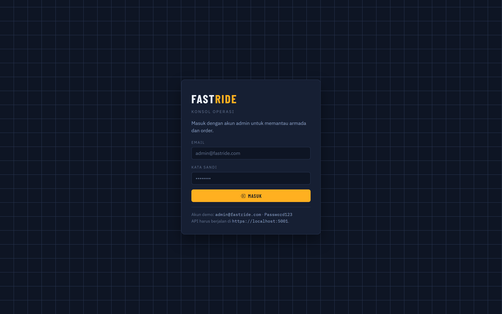

> Konsol ini **sekarang punya layar masuk**. Sebelumnya tidak ada sama sekali: dashboard
> memanggil API secara anonim, yang hanya mungkin karena tidak satu pun endpoint diperiksa.

---

## Arah desain

Bahasa visualnya diambil dari dunia tempat produk ini bekerja: **rambu transit dan lampu
lalu lintas**.

**Warna berfungsi, bukan menghias.** Setiap status di seluruh produk dipetakan ke satu dari
empat arti sinyal:

| Warna | Arti | Contoh status |
|-------|------|---------------|
| Amber | Menunggu, perlu perhatian | `Menunggu`, driver `Antar` |
| Jade | Bergerak, selesai | `Selesai`, driver `Online` |
| Vermilion | Berhenti, gagal | `Dibatalkan`, `Kedaluwarsa` |
| Biru | Dalam perjalanan, informasi | `Diterima`, `Berjalan` |

Bahasa warna yang sama dipakai di konsol admin dan kedua aplikasi mobile, jadi arti sebuah
status cukup dipelajari sekali.

**Tipografi** memikul karakternya:

| Peran | Huruf | Alasan |
|-------|-------|--------|
| Judul & navigasi | Barlow Condensed | Turunan huruf rambu jalan dan livery kendaraan |
| Teks | IBM Plex Sans | Teknis, terbaca panjang, diakritik Indonesia lengkap |
| Angka & kode | IBM Plex Mono (angka tabular) | Kolom uang dan waktu berbaris lurus seperti argometer |

---

## Fleet Pulse

Elemen khas konsol ini, hadir di atas setiap halaman:

```
ARMADA  ▮▮▮▮▮▮▮▮▮▮▮▮▯▯▯▯   14 Siap   5 Mengantar   3 Order menunggu   Rp 1,1 jt Hari ini   17:31:15 Diperbarui
```

Satu *pip* per driver, diwarnai menurut semantik sinyal dan dikelompokkan menurut keadaan.
Dibaca sekali lihat, rel ini menjawab **"berapa banyak armada yang benar-benar bekerja
sekarang"** — pertanyaan pertama seorang supervisor, dan justru yang paling buruk dijawab
oleh kartu statistik. Rel ini menyegarkan diri tiap 12 detik.

Ini satu-satunya elemen "berisik" di halaman. Sisanya sengaja tenang.

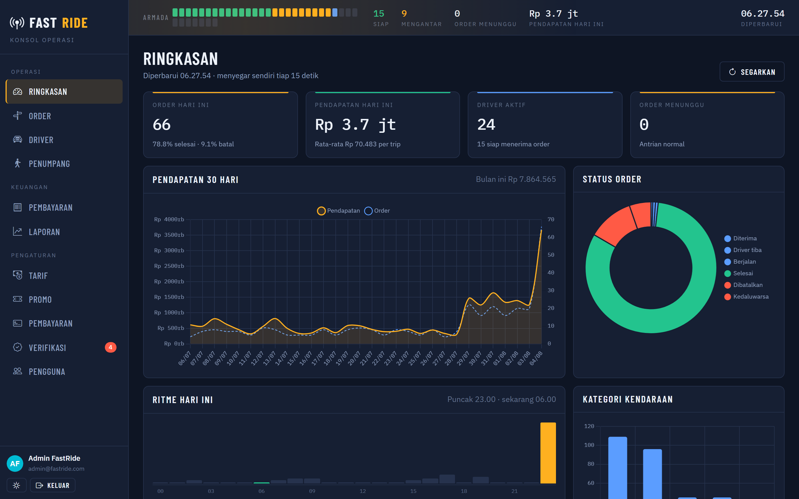

---

## Halaman

### Ringkasan (`/`)

| Bagian | Isi |
|--------|-----|
| Empat kartu | Order hari ini, pendapatan, driver aktif, order menunggu |
| Pendapatan 30 hari | Garis ganda: pendapatan + jumlah order (Chart.js) |
| Status order | Donat sebaran status |
| Ritme hari ini | Histogram per jam digambar sebagai pita jalan, jam sekarang ditandai jade dan jam tersibuk amber |
| Kategori kendaraan | Batang |
| Driver terbaik | Peringkat 30 hari |
| Metode pembayaran | Batang horizontal |

Seluruh halaman diambil dari **satu** panggilan `/api/dashboard/overview` dan menyegar tiap
15 detik. Kartu "Order menunggu" berubah merah bila antrean melewati 10 — angka saja tidak
memberi tahu operator kapan harus bertindak.

> Chart.js sebelumnya dimuat di setiap halaman tetapi tidak pernah dipanggil; semua grafik
> digambar dengan tinggi `div`. Sekarang benar-benar dipakai, dengan palet yang sama dengan
> sisa konsol.

### Order (`/orders`)

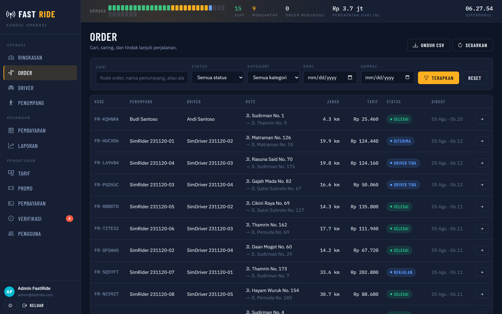

Filter: pencarian bebas (kode, nama penumpang, alamat), status, kategori, rentang tanggal.
Klik satu baris untuk membuka detail: peserta, rute lengkap dengan titik singgah, rincian
biaya, dan referensi transaksi. Perjalanan yang masih berjalan bisa dibatalkan dari sini.

Tombol **Unduh CSV** mengekspor hasil filter yang sedang tampil (maks 10.000 baris, dengan
BOM UTF-8 supaya Excel di Windows membaca teks Indonesia dengan benar).

### Driver (`/drivers`)

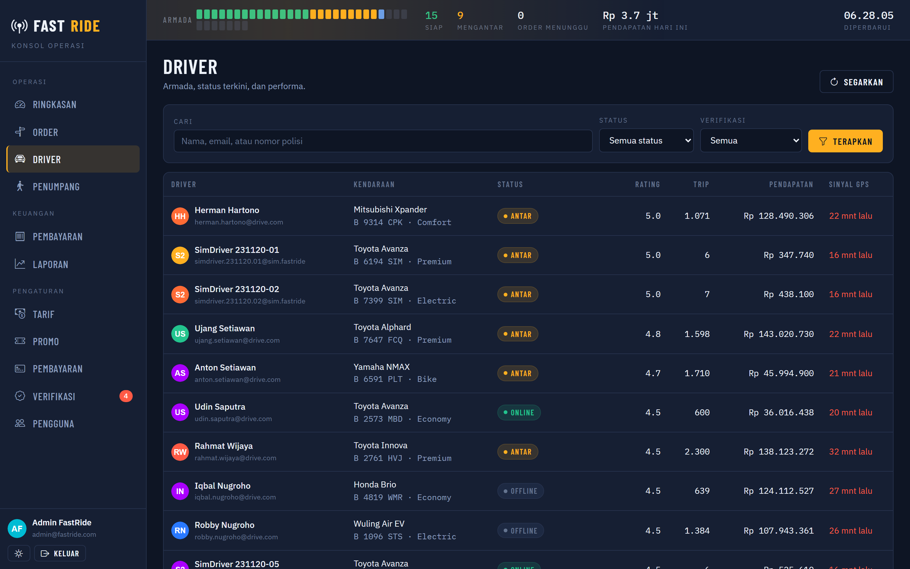

Status, rating, jumlah trip, pendapatan, dan **umur sinyal GPS**. Sinyal yang lebih tua
dari 10 menit ditandai merah — driver itu tidak ikut dipertimbangkan dalam pencocokan, dan
itu perlu terlihat.

### Penumpang (`/riders`)

Daftar penumpang dengan jumlah trip selesai dan total belanja.

### Pembayaran (`/payments`)

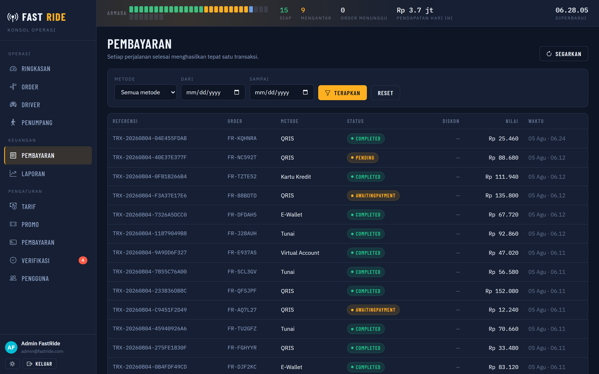

Filter metode dan rentang tanggal. Satu baris per perjalanan selesai — tidak akan pernah
ada dua, dijamin unique index pada `Payment.OrderId`.

### Laporan (`/reports`)

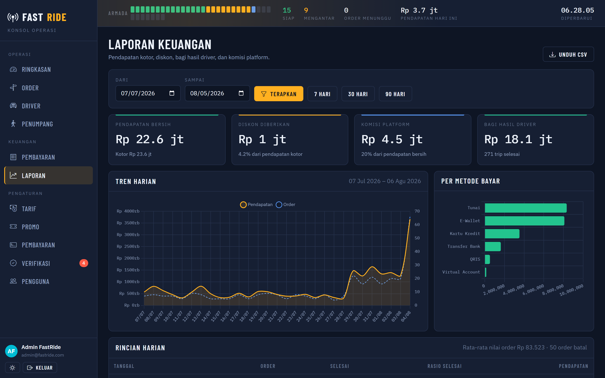

Pendapatan kotor, diskon, pendapatan bersih, komisi platform (20%), bagi hasil driver,
tren harian, dan sebaran metode bayar. Tombol pintas 7 / 30 / 90 hari, plus ekspor CSV.

### Tarif (`/fares`)

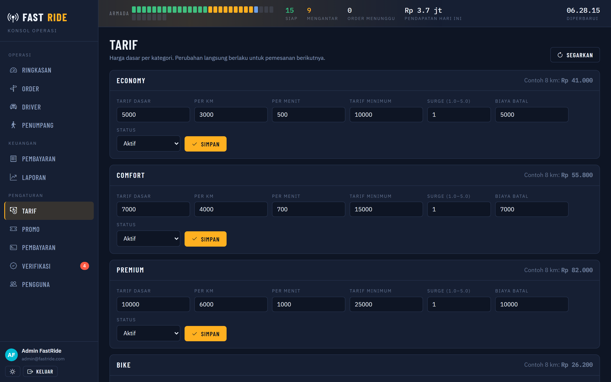

Ubah tarif dasar, per km, per menit, tarif minimum, pengali *surge*, dan biaya pembatalan
per kategori. Setiap kartu menampilkan **contoh harga untuk 8 km** yang dihitung dengan
rumus yang sama persis dengan API, jadi pratinjau tidak bisa berbeda dari tagihan
sebenarnya. Menyimpan akan membatalkan cache tarif dan langsung berlaku.

### Promo (`/promos`)

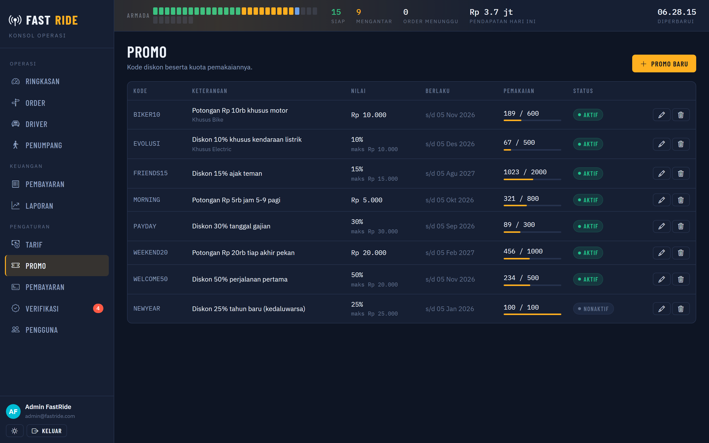

CRUD penuh dengan bilah kuota terpakai. Promo yang sudah pernah ditukar akan
**dinonaktifkan, bukan dihapus**, supaya riwayat order tetap utuh.

### Penyedia pembayaran (`/payment-providers`)

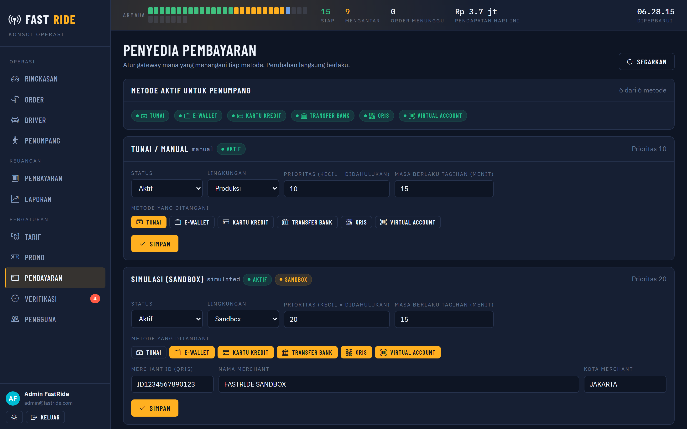

Aktifkan gateway, pilih metode yang ditanganinya, dan atur prioritas bila lebih dari satu
bisa melayani metode yang sama. Kunci **tidak pernah ditampilkan kembali** — kolomnya hanya
memberi tahu apakah sudah terisi. Selengkapnya di [`PAYMENTS.md`](PAYMENTS.md).

### Verifikasi (`/verification`)

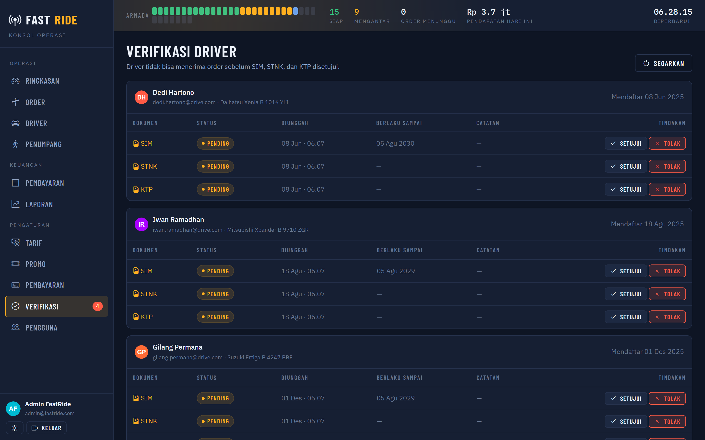

Antrean driver yang menunggu peninjauan dokumen. Setujui atau tolak SIM/STNK/KTP satu per
satu; driver otomatis terverifikasi begitu ketiganya disetujui. Jumlah antrean muncul
sebagai lencana di navigasi kiri.

### Pengguna (`/users`)

Semua akun dengan filter peran dan status. Menonaktifkan akun **langsung memutus sesinya**
— bukan menunggu tokennya kedaluwarsa. Admin tidak bisa menonaktifkan akunnya sendiri.

---

## Tema

Tombol di kaki navigasi mengganti terang/gelap. Pilihan disimpan di `localStorage` dan
diterapkan sebelum Blazor tersambung, jadi halaman tidak berkedip tema yang salah.

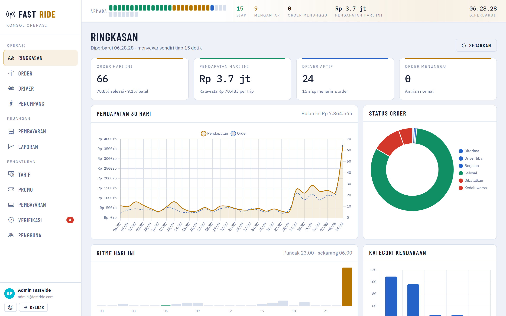

Grafik mengambil warnanya saat dibuat, sehingga pergantian tema memuat ulang halaman untuk
membangun ulang kanvas.

---

## Perilaku yang dijaga

- Responsif sampai lebar ponsel; navigasi menyusut menjadi rel ikon di bawah 860 px.
- `prefers-reduced-motion` dihormati — sapuan pada Fleet Pulse berhenti.
- Fokus keyboard terlihat di seluruh kontrol.
- Tabel lebar menggulir di dalam wadahnya sendiri; badan halaman tidak pernah menggulir
  ke samping.
- Layar kosong menjelaskan langkah berikutnya, bukan sekadar "tidak ada data".
- Kegagalan memuat memberi tahu apa yang harus diperiksa ("pastikan FastRide.Api berjalan").

---

## Sesi

Token admin disimpan di `ProtectedSessionStorage` dan dilingkupi per circuit Blazor: dua
tab tidak berbagi kredensial, dan menyegarkan halaman tidak membuat operator keluar. Bila
API membalas `401` — misalnya karena logout dari perangkat lain — konsol langsung kembali
ke layar masuk.

---

## Konfigurasi

```json
{
  "Urls": "https://localhost:5002;http://localhost:5003",
  "ApiSettings": { "BaseUrl": "https://localhost:5001", "TimeoutSeconds": 30 }
}
```

`ApiSettings:BaseUrl` **harus** cocok dengan alamat API, dan alamat konsol harus ada di
`ApiSettings:CorsOrigins` milik API. Keduanya sudah sinkron secara bawaan.
