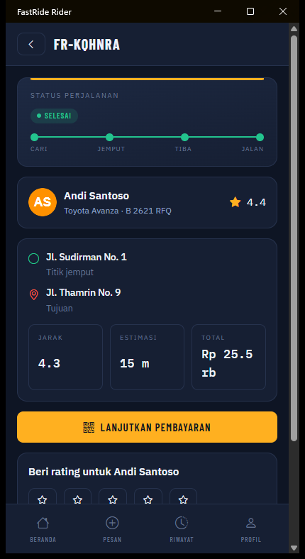
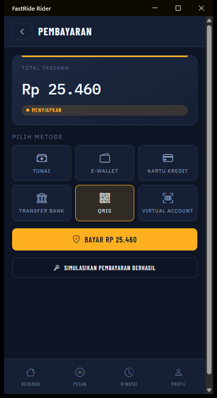

# 💳 Pembayaran — FastRide

Metode yang didukung: **tunai, QRIS, e-wallet, kartu kredit, virtual account, transfer bank**.
Gateway-nya bisa diganti dari konsol admin tanpa deploy ulang.

---

## Yang berubah dari v2.0

Sistem pembayaran lama adalah **pencatat, bukan sistem pembayaran**:

| Dulu | Sekarang |
|------|----------|
| Setiap pembayaran langsung `Completed` — uang tidak pernah berpindah | Charge dibuka ke provider, lunas hanya setelah provider mengonfirmasi |
| `TransactionReference` dibuat lokal (`TRX-...`) | Ditambah `ProviderReference` dari gateway |
| `Pending` dan `Failed` ada di enum tapi **tidak pernah dipakai** | Seluruh siklus dipakai, plus `AwaitingPayment` dan `Expired` |
| QRIS tidak ada | Metode utama, dengan payload EMVCo sungguhan |
| Nol integrasi PSP | Manual, Simulasi, Midtrans, Xendit |

---

## Model: satu baris = satu *payment intent*

Ada **tepat satu baris `Payment` per order**, dijaga unique index pada `Payment.OrderId`.
Itulah yang membuat satu perjalanan tidak bisa ditagih dua kali.

Barisnya adalah mesin status, bukan kuitansi:

```
Pending ──► AwaitingPayment ──┬──► Completed        (uang diterima)
   ▲                          ├──► Failed          ┐
   │                          └──► Expired         │ bisa dicoba lagi
   └──────────────────────────────────────────────┘
```

Percobaan yang gagal **mengatur ulang baris yang sama**, bukan menyisipkan baris kedua.

> Ini penting. Unique index yang ditambahkan di v2.0 untuk mencegah double-charge akan
> **mengunci order selamanya** begitu pembayaran benar-benar bisa gagal. Model intent
> mempertahankan jaminannya sekaligus mengizinkan percobaan ulang. Filtered index bukan
> pilihan — MySQL tidak mendukungnya.

---

## Provider

| Nama | Untuk apa | Kredensial |
|------|-----------|------------|
| `manual` | Tunai. Driver menerima uang, selesai di tempat | Tidak perlu |
| `simulated` | Demo, simulator, dan test. QRIS EMVCo asli, tanpa jaringan | Tidak perlu |
| `midtrans` | Core API. QRIS, GoPay, ShopeePay, kartu, VA | Server key |
| `xendit` | QR Code & e-wallet API. QRIS, DANA, OVO, VA | Secret key |

Menambah provider = mengimplementasikan `IPaymentProvider` dan menyalakannya di konfigurasi.
Tidak ada bagian lain yang perlu diubah.

```csharp
public interface IPaymentProvider
{
    string Name { get; }
    IReadOnlyCollection<PaymentMethod> SupportedMethods { get; }
    bool SettlesImmediately { get; }

    Task<PaymentChargeResult> ChargeAsync(PaymentChargeRequest request, CancellationToken ct);
    Task<PaymentStatusResult> QueryAsync(PaymentQueryRequest request, CancellationToken ct);
    PaymentCallback? ReadCallback(PaymentCallbackContext context);
}
```

---

## Konfigurasi

Dua sumber: `appsettings.json` dan database. **Baris database menang**, jadi operator bisa
ganti provider, putar kunci, atau turun ke sandbox lewat konsol admin tanpa deploy ulang.
Provider di berkas disalin ke database saat start pertama; baris yang sudah ada tidak
disentuh.

```json
"Payments": {
  "Providers": [
    { "Name": "manual",    "Enabled": true,  "Priority": 10, "Methods": [ "Cash" ] },
    { "Name": "simulated", "Enabled": true,  "Priority": 20, "Methods": [ "Qris", "EWallet", "CreditCard", "VirtualAccount", "BankTransfer" ] },
    { "Name": "midtrans",  "Enabled": false, "Priority": 30, "Methods": [ "Qris", "EWallet", "CreditCard", "VirtualAccount" ] },
    { "Name": "xendit",    "Enabled": false, "Priority": 40, "Methods": [ "Qris", "EWallet", "VirtualAccount" ] }
  ]
}
```

`Priority` menentukan siapa yang dipakai bila lebih dari satu provider aktif menangani metode
yang sama — angka terkecil menang. Ini memungkinkan memindahkan trafik antar-gateway tanpa
menonaktifkan salah satunya.

### ⚠️ Kredensial

**Jangan taruh kunci produksi di `appsettings.json`.** Pakai variabel lingkungan:

```bash
export Payments__Providers__2__ServerKey="Mid-server-..."
export Payments__Providers__2__WebhookSecret="..."
```

atau isi lewat konsol admin. Kunci **tidak pernah dikembalikan** oleh API — respons hanya
melaporkan apakah sebuah kunci sudah terisi (`hasServerKey: true`). Konsol yang bisa
menampilkan rahasia adalah konsol yang bisa membocorkannya.

CI menolak commit yang mengandung kunci produksi Midtrans (`Mid-server-`, `Mid-client-`)
atau Xendit (`xnd_production_`).

---

## QRIS

QRIS adalah standar QR nasional Indonesia, dibangun di atas spesifikasi EMVCo
merchant-presented QR: rangkaian tag-length-value yang ditutup checksum CRC-16/CCITT-FALSE.

Provider sungguhan mengembalikan payload-nya sendiri. Provider simulasi **membangunnya**,
sehingga yang dihasilkan benar-benar bisa dipindai dan lolos verifikasi checksum — bukan
placeholder yang sekadar mirip.

```
00020101021226440014ID.CO.QRIS.WWW0115ID12345678901230203UMI520441215303360
5405254605802ID5916FASTRIDE SANDBOX6007JAKARTA62270523TRX-20260804-29A6AF53C06304B608
```

| Tag | Isi |
|-----|-----|
| `00` | Versi format |
| `01` | `12` = QR dinamis (satu QR per transaksi, nominal terkunci) |
| `26` | Merchant account: `ID.CO.QRIS.WWW` + National Merchant ID |
| `53` | `360` = IDR |
| `54` | Nominal |
| `58` `59` `60` | Negara, nama merchant, kota |
| `62` | Referensi transaksi kita |
| `63` | CRC-16 |

QR di-*render* jadi SVG di sisi API (`QrCodeRenderer`), jadi kedua aplikasi mobile mendapat
kode identik tanpa membawa dependensi grafis.

---

## Alur

### Tunai

```
Driver menyelesaikan trip ──► Payment langsung Completed
```

Tidak ada pihak ketiga. Provider `manual` ada supaya tunai melewati jalur kode yang sama
dengan kartu atau QR, bukan menjadi kasus khusus yang tersebar.

### Non-tunai

```
Trip selesai ──► Payment Pending (trip tidak menunggu pembayaran)
     │
Rider buka layar bayar ──► POST /api/payments ──► charge ke provider
     │
     ├──► QRIS: tampilkan QR
     ├──► VA: tampilkan nomor
     └──► wallet/kartu: arahkan ke halaman provider
     │
Rider bayar ──► provider kirim callback ──► verifikasi tanda tangan ──► Completed
```

Trip **tidak menunggu pembayaran**. Driver bisa langsung menerima order berikutnya.

Seperti yang dilihat penumpang:

<table>
<tr>
<td width="25%"><br /><sub>Trip selesai — tagihan masih terbuka</sub></td>
<td width="25%"><br /><sub>Metode yang tampil datang dari provider yang aktif</sub></td>
<td width="25%"><br /><sub>QRIS + waktu kedaluwarsa</sub></td>
<td width="25%"><br /><sub>Lunas, dengan referensi transaksi</sub></td>
</tr>
</table>

Daftar metode **tidak di-hardcode di aplikasi** — ia mengikuti apa yang benar-benar
diaktifkan operator di konsol, jadi mematikan sebuah gateway langsung menghilangkan
metodenya dari layar ini.

---

## Callback

`POST /api/payments/webhook/{provider}` — anonim (PSP tidak punya token), tapi **setiap
permintaan diverifikasi** sebelum satu field pun dipercaya.

| Provider | Cara verifikasi |
|----------|-----------------|
| `midtrans` | SHA-512 dari `order_id + status_code + gross_amount + serverKey` |
| `xendit` | Token statis di header `x-callback-token`, dibandingkan konstan-waktu |
| `simulated` | HMAC-SHA256 atas body dengan webhook secret |

Perlindungan yang berlaku di semua provider:

- **Tanda tangan salah → `401`**, dan alasannya tidak pernah dikembalikan ke pemanggil —
  itu akan membantu menyempurnakan pemalsuan.
- **Idempoten.** Provider mengulang callback; "lunas" yang sama boleh datang berkali-kali.
- **Callback terlambat tidak bisa membatalkan pembayaran yang sudah lunas.**
- **Nominal diperiksa.** Callback yang mengaku menerima jumlah berbeda dari yang ditagih
  ditolak dan dicatat sebagai error.
- **Rate limit sendiri** (`RateLimiting:WebhookPermitPerMinute`), longgar supaya retry sah
  tidak ditolak.

Callback bukan satu-satunya jalan: `GET /api/payments/order/{orderId}` menanyakan status ke
provider bila baris lokal masih menunggu, sehingga callback yang hilang tidak membuat
perjalanan yang sudah dibayar tergantung.

---

## Sandbox

`POST /api/payments/sandbox/{orderId}/settle` dan `/fail` berperan sebagai pembayar terhadap
provider simulasi. Keduanya **melewati jalur callback sungguhan** — body ditandatangani lalu
diverifikasi seperti biasa — jadi mengujinya berarti menguji kode yang berjalan di produksi.

Hanya di-*map* di luar Production. Di deployment nyata endpoint ini tidak ada, karena kalau
ada, siapa pun bisa menandai trip-nya sendiri lunas.

---

## Menghubungkan gateway sungguhan


1. Daftar akun sandbox di [Midtrans](https://dashboard.sandbox.midtrans.com) atau
   [Xendit](https://dashboard.xendit.co).
2. Buka **Konsol admin → Pembayaran**.
3. Isi server key dan webhook secret, pilih metode, set **Sandbox**, aktifkan.
4. Klik **Uji koneksi** — membuka charge Rp 1.000 dan melaporkan hasilnya.
5. Daftarkan URL callback di dashboard provider (konsol menampilkannya):
   `https://api.anda.com/api/payments/webhook/midtrans`
6. Setelah yakin, ganti ke kunci produksi dan matikan **Sandbox**.

Nonaktifkan `simulated` sebelum produksi — kalau tidak, ia bisa menangani metode yang
seharusnya diambil gateway sungguhan.

---

## Endpoint

| Metode | Rute | Akses | Keterangan |
|--------|------|-------|------------|
| GET | `/api/payments/methods` | `auth` | Metode yang sedang aktif |
| GET | `/api/payments/order/{orderId}` | peserta | Status pembayaran sebuah order |
| POST | `/api/payments` | peserta | Buka atau ulangi charge (idempoten) |
| GET | `/api/payments` | `admin` | Daftar + filter |
| POST | `/api/payments/webhook/{provider}` | `anon` | Callback, terverifikasi tanda tangan |
| GET | `/api/admin/payment-providers` | `admin` | Konfigurasi provider |
| PUT | `/api/admin/payment-providers/{name}` | `admin` | Simpan konfigurasi |
| POST | `/api/admin/payment-providers/{name}/test` | `admin` | Uji koneksi |

---

## Pengujian

Dicakup oleh 40+ test di [`TESTING.md`](TESTING.md):

| Jaminan | Test |
|---------|------|
| Payload QRIS lolos checksum-nya sendiri | `QrisPayloadTests` |
| Payload yang diubah ditolak | `IsValid_RejectsAPayloadWhoseContentWasAltered` |
| CRC cocok dengan vektor uji standar | `Crc16_MatchesTheKnownCcittFalseVector` |
| Charge ulang mengembalikan QR yang sama | `ChargingTwiceReturnsTheSameCode` |
| Gagal bisa dicoba lagi | `ADeclinedChargeCanBeRetried` |
| Retry tidak pernah membuat pembayaran kedua | `RetryingNeverCreatesASecondPayment` |
| Tanda tangan palsu ditolak | `Simulated_RejectsACallbackWithAForgedSignature` |
| Body yang diubah setelah ditandatangani ditolak | `Simulated_RejectsACallbackWhoseBodyWasAlteredAfterSigning` |
| Callback berulang tidak mengubah apa pun | `ARepeatedSettlementCallbackChangesNothing` |
| Callback gagal yang terlambat tidak membatalkan pelunasan | `ALateFailureCallbackCannotUnpayASettledTrip` |
| Fraud challenge Midtrans bukan berarti lunas | `Midtrans_TreatsAFraudChallengeAsUnsettled` |

Simulator juga menyelesaikan pembayaran, jadi smoke test CI mencakup seluruh alur.

---

## Yang belum ada

| Item | Catatan |
|------|---------|
| Refund | Status `Refunded` ada, tapi belum ada endpoint yang memicunya |
| Pembayaran sebagian | Satu charge per order |
| Dompet & top-up | E-wallet lewat gateway, belum ada saldo internal |
| Payout ke driver | `TotalEarnings` dihitung, pencairannya belum |
| Rekonsiliasi terjadwal | Status ditanyakan saat dibaca, belum ada job berkala |
