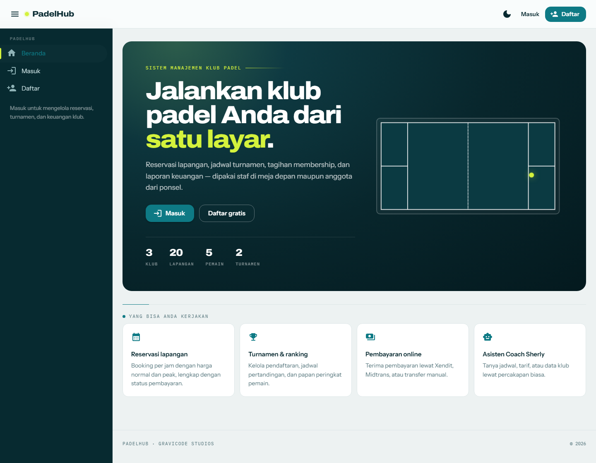
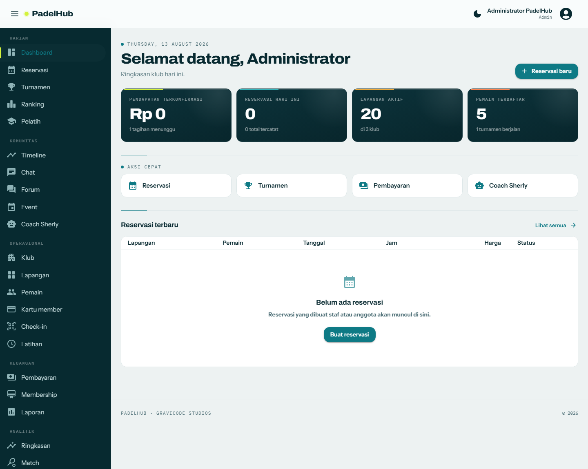
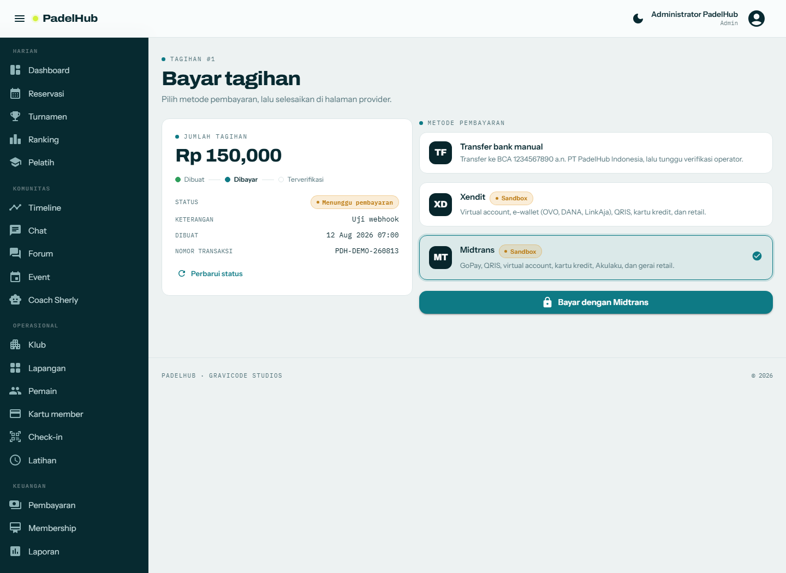
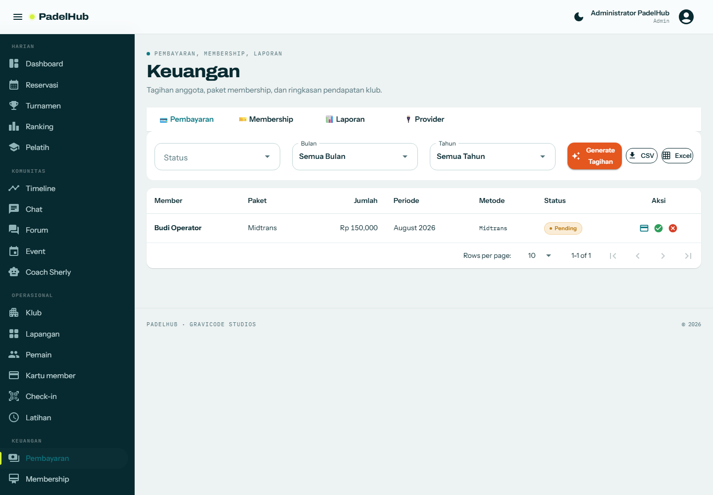
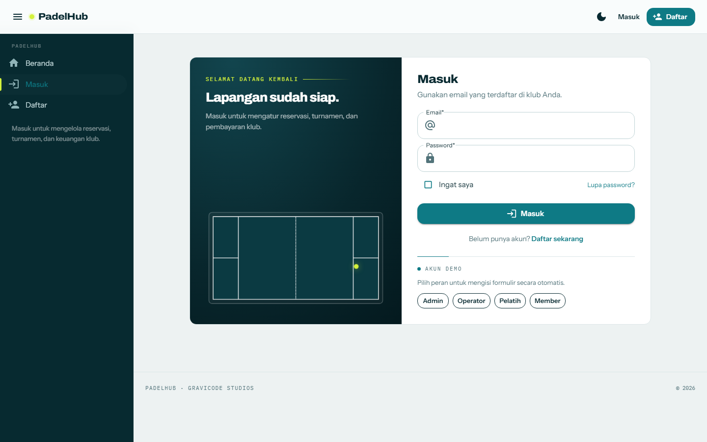
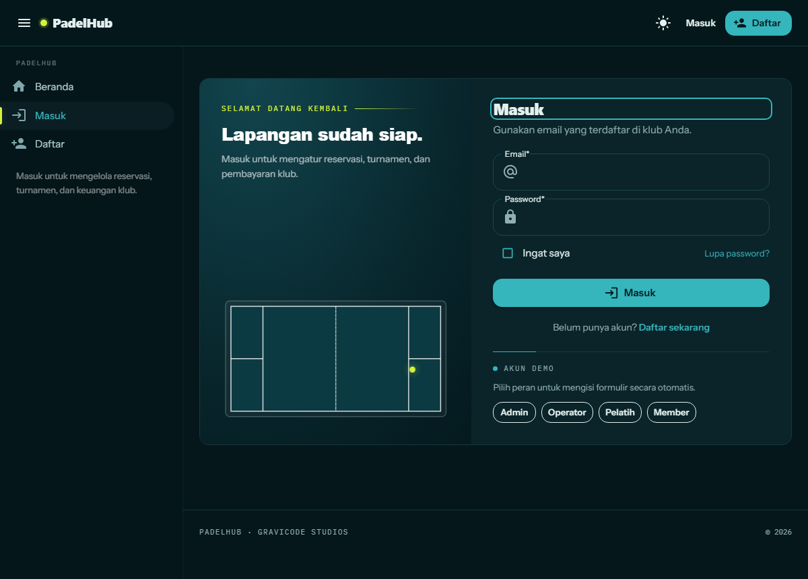

# 🎾 PadelHub - Sistem Manajemen Padel

**PadelHub** adalah aplikasi manajemen padel komprehensif untuk klub, turnamen, dan pemain individu. Dibangun dengan **Blazor Server .NET 10** dan **MudBlazor**, dengan design system sendiri bernama *Court Glass & Floodlight*.

---

## 📸 Tampilan Aplikasi

| | |
|---|---|
| <br>**Halaman depan** — denah lapangan dengan proporsi sebenarnya | <br>**Dashboard** — plat papan skor dan aktivitas hari ini |
| <br>**Checkout** — pilih metode pembayaran | <br>**Keuangan** — tagihan, membership, laporan, status provider |
| <br>**Masuk** — panel terbelah dengan motif lapangan | <br>**Mode gelap** — lapangan malam, tersimpan antar sesi |

---

## ✨ Fitur Utama

### 🎾 Fitur Inti
- **Manajemen Klub**: Profil klub, lapangan, fasilitas, jam operasional
- **Reservasi Lapangan**: Booking online, kalender interaktif, pembayaran otomatis
- **Turnamen & Liga**: Pendaftaran, bracket otomatis, jadwal pertandingan, hasil real-time
- **Profil Pemain**: Statistik, ranking, riwayat pertandingan, pencapaian
- **Pelatih & Kursus**: Jadwal latihan, booking sesi, materi pelatihan

### 💳 Keuangan
- **Pembayaran Online**: Provider bisa dipasang-lepas — Xendit (Invoice API), Midtrans (Snap), dan transfer bank manual, dengan webhook terverifikasi
- **Paket Membership**: Paket bulanan/tahunan, diskon, loyalty points
- **Laporan Keuangan**: Pendapatan, pengeluaran, analitik transaksi

### 📊 Analitik & Monitoring
- **Statistik Pertandingan**: Skor, performa pemain, heatmap pukulan
- **Dashboard Klub**: Tren reservasi, popularitas lapangan, aktivitas anggota
- **Ranking & Rating**: Sistem poin otomatis, leaderboard mingguan/bulanan

### 📱 Sosial & Komunitas
- **Chat & Forum**: Diskusi antar pemain, grup komunitas
- **Event Sosial**: Gathering, fun match, charity event
- **Timeline**: Share hasil pertandingan, highlight, komentar, likes, emoji

### 🔒 Keamanan & Admin
- **Autentikasi**: Login, register, reset password, edit profil
- **Master Data**: CRUD lengkap, Export CSV/Excel, Filter, Sort, Paging
- **Kartu Member**: Cetak dengan QR Code
- **Check-in**: Scan QR atau input nomor member
- **Audit Log**: Catatan aktivitas dengan filter & pencarian

### 🚀 Fitur Kompetitif
- **AI Match Analysis**: Analisis video dengan AI
- **Smart Scheduling**: Algoritma penjadwalan optimal
- **IoT Integration**: Sensor lapangan, tracking bola, smart lighting simulator
- **Gamifikasi**: Badge, achievement, leaderboard komunitas
- **REST API**: Minimal API dengan dokumentasi Swagger

### 🤖 Chat Bot - Coach Sherly
- Multi-session chat dengan reset
- Support attach gambar dan dokumen
- Dukungan multi AI model (OpenAI, Anthropic, Gemini, Ollama)
- Integrasi Semantic Kernel
- Render markdown ke HTML

---

## 🛠️ Tech Stack

| Teknologi | Kegunaan |
|-----------|----------|
| .NET 10 | Runtime |
| Blazor Server | UI Framework |
| MudBlazor 9 | Komponen Material Design |
| Entity Framework Core | ORM |
| ASP.NET Identity | Autentikasi |
| Semantic Kernel | Integrasi AI |
| SQLite/SQLServer/MySQL/PostgreSQL | Database |
| Markdig | Render Markdown |
| QRCoder | Generate QR Code |
| ClosedXML | Export Excel |
| CsvHelper | Export CSV |

---

## 🚀 Memulai

### Prasyarat
- .NET 10 SDK
- (Opsional) SQL Server, MySQL, atau PostgreSQL

### Menjalankan
```bash
cd PadelHub
dotnet run
```

Buka `https://localhost:5001` di browser.

### Akun Default
| Role | Email | Password |
|------|-------|----------|
| Admin | admin@padelhub.com | Admin@123 |
| Operator | operator@padelhub.com | Operator@123 |
| Coach | coach.andi@padelhub.com | Coach@123 |
| Member | rina@padelhub.com | Member@123 |

---

## 📁 Struktur Proyek

```
PadelHub/
├── Components/
│   ├── Layout/         # Layout utama, navigasi
│   ├── Pages/          # Semua halaman aplikasi
│   └── Shared/         # Komponen bersama
├── Data/               # DbContext
├── Models/             # Model entity
├── Services/           # Layanan bisnis
├── wwwroot/            # File statis
├── docs/               # Dokumentasi
└── Program.cs          # Entry point
```

---

## ⚙️ Konfigurasi

Edit `appsettings.json` untuk mengubah:
- **Database**: SQLite (default), SQLServer, MySQL, PostgreSQL
- **Storage**: FileSystem (default), Azure Blob, S3, MinIO
- **AI Model**: OpenAI, Anthropic, Gemini, Ollama
- **Chat Bot**: System prompt, temperature, max tokens
- **Pembayaran**: Transfer manual (default), Xendit, Midtrans

### Payment gateway

Setel `Payments:Providers:<Nama>:Enabled` menjadi `true` lalu isi kredensialnya:

| Provider | Kredensial | URL notifikasi yang didaftarkan |
|----------|------------|---------------------------------|
| Xendit | `SecretKey`, `CallbackToken` | `POST {BaseUrl}/api/payments/webhook/xendit` |
| Midtrans | `ServerKey`, `IsProduction` | `POST {BaseUrl}/api/payments/webhook/midtrans` |

Isi `Payments:BaseUrl` dengan alamat publik aplikasi (misalnya URL ngrok saat pengembangan) supaya URL kembali dan webhook bisa dijangkau. Notifikasi ditolak kalau callback token Xendit atau signature SHA-512 Midtrans tidak cocok, dan tagihan tidak pernah ditandai lunas bila nominal yang diberitahukan berbeda dari nominal tagihan.

---

## 🙏 Kredit

Dibuat dengan ❤️ oleh **GraviCode Studios**  
Dipimpin oleh: Kang Fadhil  
AI Assistant: Jacky the Code Bender

Kalau merasa terbantu, traktir pulsa dong! 🎾  
https://studios.gravicode.com/products/budax

---

**PadelHub** - Solusi Manajemen Padel Lengkap! 🎾
